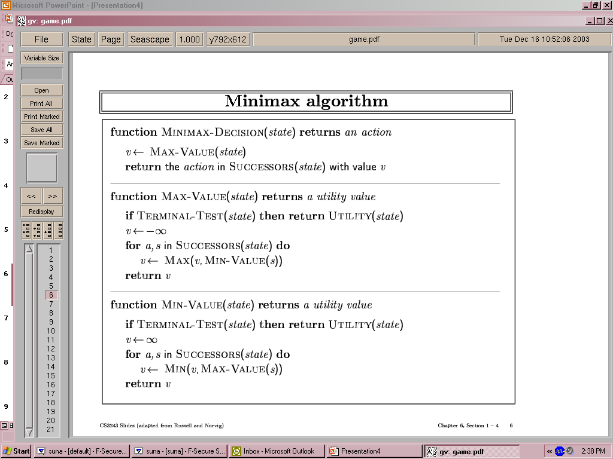

# IIA-2022-2-UNB
Trabalhos realizados para matéria de Introdução a Inteligência Artificial 2022/2 UNB

Para o primeiro trabalho foi utilizado a seguinte especificação algoritmo minmax pela implementação pelo python, e com exemplo de jogo da velha (jogo_da_velha.py)

Para o segundo trabalho ele se encontra no seguinte link:
https://colab.research.google.com/drive/1yFoZnfOgQiA5eCEQ4uv6dsgRz57f-JxF?usp=sharing
